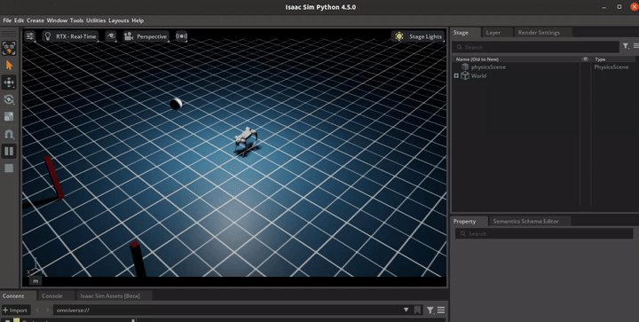

# Isaac Robot Messi: Massively Parallel Set-Piece Shootout ⚽️🤖

*Figure 1: Milestone 1 Physics Verification. Demonstrates the Unitree Go2 quadruped spawning and interacting with a dynamic football using PhysX 5. The robot acts as a passive ragdoll here as PD controllers are not yet active.*

## 🚀 Quick Navigation
- **[Onboarding & Setup Guide](docs/01_ONBOARDING.md)**: Hardware requirements, Isaac Sim standalone installation, and API troubleshooting.
- **[Milestone 1: Physics & Visualization](docs/02_MILESTONE_1.md)**: Scene verification and CLI tools for generating optimized demo GIFs.

## Overview
A high-performance Reinforcement Learning (RL) sandbox built on **NVIDIA Isaac Sim** and **OpenUSD**. This project trains a quadruped robot to execute dynamic set-piece shootouts (kicking a football into a target goal) using purely joint-level PD control. 

Designed from an architectural perspective, this repository demonstrates the paradigm shift from traditional CPU-bound simulations to massively parallel, tensor-based GPU physics pipelines for Embodied AI.

## Problem Formulation
The "shootout" is modeled as a highly dynamic rigid-body interaction problem. The agent must learn to:
1. Align its base ego-centric frame with the randomized target.
2. Generate sufficient momentum via locomotion.
3. Execute a precise contact strike to transfer impulse to a free-moving rigid body (the football), overcoming ground friction to reach the goal zone.

## Architecture & Scope
This project isolates the core challenges of modern physics-based AI:
* **Zero-Copy MDP Pipeline:** Bypassing CPU bottlenecks by extracting full-state tensors (robot joints, root states, ball dynamics, and contact forces) directly from the PhysX 5 GPU solver into PyTorch.
* **Procedural Scene Composition:** Dynamically generating thousands of localized "pitches," randomized football positions, and goal targets utilizing OpenUSD Composition Arcs.
* **Sim-to-Real Readiness:** Injecting physical noise (varying ground friction, ball mass, and restitution) through Domain Randomization (DR) to ensure robust impulse-transfer policies.

## Objectives
1. **Scale & Throughput:** Achieve >10,000 FPS during PPO training across 2048+ parallel environments on a single 24GB GPU in Headless mode.
2. **Emergent Behavior:** Train the agent to zero-shot generalize its striking strategy across varying ball distances and angles without hard-coded inverse kinematics (IK).

## Tech Stack
* **Simulation Engine:** NVIDIA Isaac Sim (PhysX 5.x)
* **Data Backbone:** OpenUSD (Universal Scene Description)
* **Deep Learning:** PyTorch
* **RL Algorithm:** Stable Baselines3 / skrl

## Hardware & Execution Paradigm
This project utilizes a split-compute architecture to accommodate hardware constraints:
* **Local Development (RTX 3070 8GB / Ubuntu 20.04):** Used exclusively for OpenUSD scene composition, tensor logic debugging, and single/low-count environment testing with GUI enabled.
* **Cloud Scaling (24GB+ VRAM):** Used for massively parallel PPO training (2048+ envs) in headless mode to achieve >10,000 FPS.

## Repository Structure
* `docs/`: Detailed guides for onboarding and milestone execution.
* `media/`: Visual assets and performance recordings.
* `configs/`: YAML configurations for simulation parameters and RL hyperparameters.
* `envs/`: Core RL environment logic (`step`, `reset`, tensor extraction).
* `scripts/`: Execution entry points (e.g., `train.py`, `check_scene.py`, `process_demo.py`).
* `messi_utils/`: Helpers for batched math and USD procedural generation.
